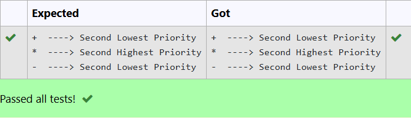

# EX 1 Display operator precedence in the Infix Expression

## DATE: 21/02/2025

## AIM:

To write a C program to find and display the priority of the operator in the given Postfix expression.

## Algorithm

1. Start the program.

2. Include the required libraries

3. Define a function to display the priority of the operator in a postfix expression.

4. Use if-else or switch case statements to specify the priority and return it.

5. End the program.

## Program:

```c
/*
Program to find and display the priority of the operator in the given Postfix expression

Developed by: Santhosh T
RegisterNumber: 212223220100
*/

#include <stdio.h>

#include<string.h>

int main()
{
    int i,j;
    char ch[100]="+7*45-20";
    for(i=0; i<strlen(ch); i++)
    {
        if(ch[i]=='+'||ch[i]=='*'||ch[i]=='-')
        {
            j=priority(ch[i]);
            switch(j)
            {
            case 1:
                printf("%c  ----> ",ch[i]);
                printf("Lowest Priority\n");
                break;
            case 2:
                printf("%c  ----> ",ch[i]);
                printf("Second Lowest Priority\n");
                break;
            case 3:
                printf("%c  ----> ",ch[i]);
                printf("Second Highest Priority\n");
                break;

            }
        }
    }
    return 0;
}


```

## Output:



## Result:

Thus the C program to find and display the priority of the operator in the given Postfix expression is implemented successfully.
