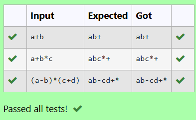

# Ex2 Conversion of the Infix Expression into Postfix Expression
## DATE: 21/02/2025
## AIM:
To write a C program to convert the infix expression into postfix form using stack by following the operator precedence and associative rule.

## Algorithm
1. Start the program.

2. Include the required libraries.

3. Define functions for push and pop operations to handle the stack and define a function to return the priority of the operators.

4. Construct the function to convert an infix expression into postfix following the logic.

5. End the program.
  

## Program:
```c
/*
Program to convert the Infix Expression into Postfix Expression

Developed by: Santhosh T
RegisterNumber: 212223220100
*/

#include<stdio.h>
#include<ctype.h>

char stack[100];
int top = -1;

void push(char x)
{
    top = top + 1;
    stack[top] = x;
}

char pop()
{
    return stack[top--];
}

int precedence(char x)
{
    if (x == '(')
        return 0;
    if (x == '+' || x == '-')
        return 1;
    if (x == '*' || x == '/')
        return 2;
    return 0;
}

int main()
{
    char exp[100], *e, x;
    char postfix[100];
    int i = 0;
    scanf("%s", exp);
    e = exp;
    while (*e != '\0')
    {
        if (isalnum(*e))
        {
            postfix[i++] = *e;
        }
        else if (*e == '(')
        {
            push(*e);
        }
        else if (*e == ')')
        {
            while ((x = pop()) != '(')
            {
                postfix[i++] = x;
            }
        }
        else
        {
            while (top != -1 && precedence(stack[top]) >= precedence(*e))
            {
                postfix[i++] = pop();
            }
            push(*e);
        }
        e++;
    }
    while (top != -1)
    {
        postfix[i++] = pop();
    }
    postfix[i] = '\0';
    printf("%s\n", postfix);
    return 0;
}


```

## Output:




## Result:
Thus, the C program to convert the infix expression into postfix form using stack by following the operator precedence and associative rule is implemented successfully.
